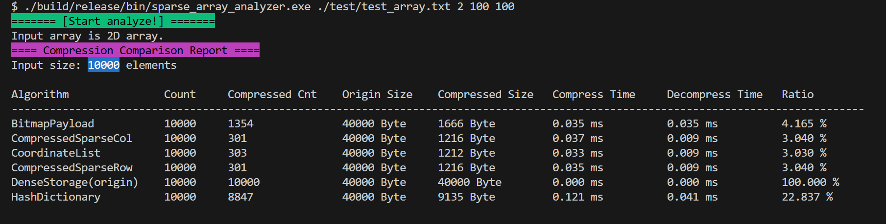

<!--
 * @Author: FeOAr feoar@outlook.com
 * @Date: 2025-06-15 14:31:55
 * @LastEditors: FeOAr feoar@outlook.com
 * @LastEditTime: 2025-07-20 15:25:33
 * @FilePath: \SparseArrayAnalyzer\README.md
 * @Description: 
 * 
-->
在嵌入式或资源受限环境中。一个**稀疏数组收益计算器**可以帮助你评估压缩是否值得，避免“优化过度”。

# 一、它可以帮你：

1. **统计非零元素的比例**（稀疏程度）。
2. **估算稀疏表示节省的内存**（例如用键值对 vs 全量数组）。
3. **计算读写访问的复杂度开销**。
4. **可视化压缩后 vs 原始数据的大小对比**。

---

# 二、一维 & 二维数组支持情况

| 算法名                  |   一维  |   二维   | 说明                  |
| --------------------    | :----: | :------: | --------------------- |
| **Dense** (origin)      | ✅    | ✅      | 无压缩，直接保存原始数组          |
| **Bitmap+Value Array**  | ✅    | ✅      | 记录非零掩码 + 数据，适用于低稀疏度场景 |
| **Coordinate**          | ⛔️    | ✅      | 坐标压缩，主要针对**二维矩阵**压缩   |
| **CSR**                 | ⛔️    | ✅      | 行压缩，仅适用于二维            |
| **CSC**                 | ⛔️    | ✅      | 列压缩，仅适用于二维            |
| **HashDictionary**      | ✅    | ⛔️      | 适合一维，二维需要哈希坐标或复杂映射   |
| **RunLength**           | ✅    | ⛔️      | 一维最合适，二维需线性化或特殊编码     |

---

# 三、使用方法
1. 使用 Makefile 编译
2. 运行稀疏数组生成工具
```shell
./build/release/bin/generate_sparse_matrix.exe -r 100 -c 100 -p diagonal -s 0.6 -m 1 -n 999 -o ./test/test_array.txt -v 0
```
3. 运行分析工具
```shell
./build/release/bin/sparse_array_analyzer.exe ./test/test_array.txt 2 100 100
```
4. 运行效果示意



---

# 四、待优化
1. 游程编码兼容二维输入
2. 支持多种数组变量类型
3. 给出压缩建议